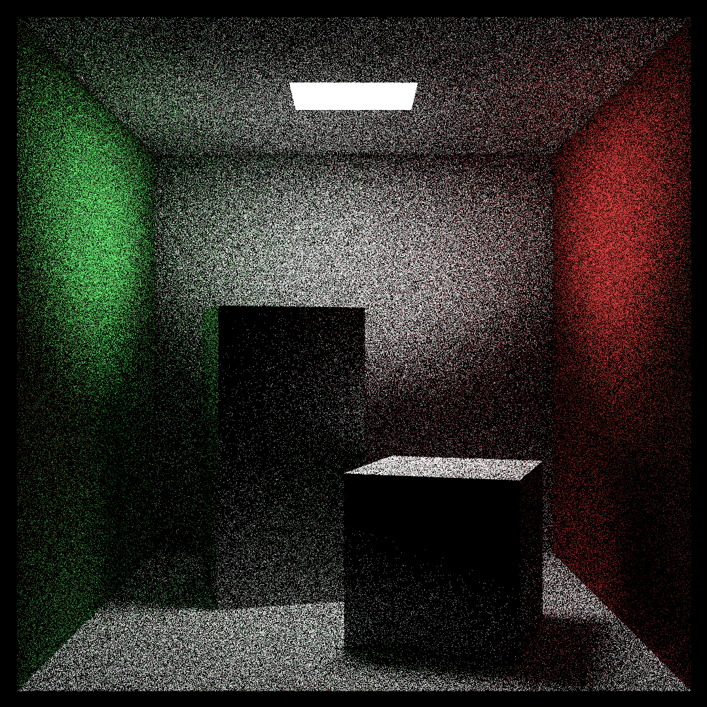

# Games&Graphics

This is a summary repository of my self-made games and graphics projects! The brief descriptions and links are below!

## Splatoon(UE version)

    link:[GitHub - LihengW/Splatoon_UE](https://github.com/LihengW/Splatoon_UE)

    *This is a demo of Splatoon remaked in Unreal Engine 5.4. The overall goal of this project is to replicate and improve the system of Splatoon. This project will cover all the concepts in the PVE parts. The goal of players is to collect eggs and bring them back to a tank. At the same time, players must kill or escape from oceans of hungry fish.*

   *The core gameplay includes spraying colorful decals on the floor and walls, and players can move quickly within their own color. However, the fishes will try to stop the players and produce different colors, cause damage and steal eggs. The color mechanism was developed using dynamic rendering textures and UV manipulation. By the way, a PSO (Particle Swarm Optimization) algorithm is applied for the AI of massive fish groups, it makes fish can share information in a hive mind, but also helps fish keep their own target in mind.*

## Swirl

    link: [GitHub - LihengW/Swirl: A Basic 2D Game Engine demo](https://github.com/LihengW/Swirl)

    *Swirl is a game engine compiled on C++ with some basic game making functions. The engine is now only supported on Windows and by OpenGL graphics API. The 2D Renderer with VertexBuffer and Texture has been implemented in the engine. Also, an Event System has been developed, so you can freely control inputs and design your own custom events to run the game process.*

## Nowhere to Escape

    link: [GitHub - LihengW/Nowhere_to_Escape](https://github.com/LihengW/Nowhere_to_Escape)

    *Nowhere to Escape is a self-designed independent game made on Unity. It's a multiplayer party game! The core mechanism of game is inspired by famous tradition table games and Weiqi. When you want to experience both interesting chaoes and delicate calculation and predictions, This will definitely be a good try!*

## Pathtrace Picture Generator

    link: [GitHub - LihengW/RayTracing: A Raytracing Renderer which is able to create fancy pictures! ](https://github.com/LihengW/RayTracing)

    *Pathtrace Picture Generator is a small program where you can create beautiful pictures with PathTracing tech. PathTracing is a kind of RayTracing Tech, and this project has implemented many kinds of materials which can be altered by your design. Also, you can use components inside to create objects and noises.*

